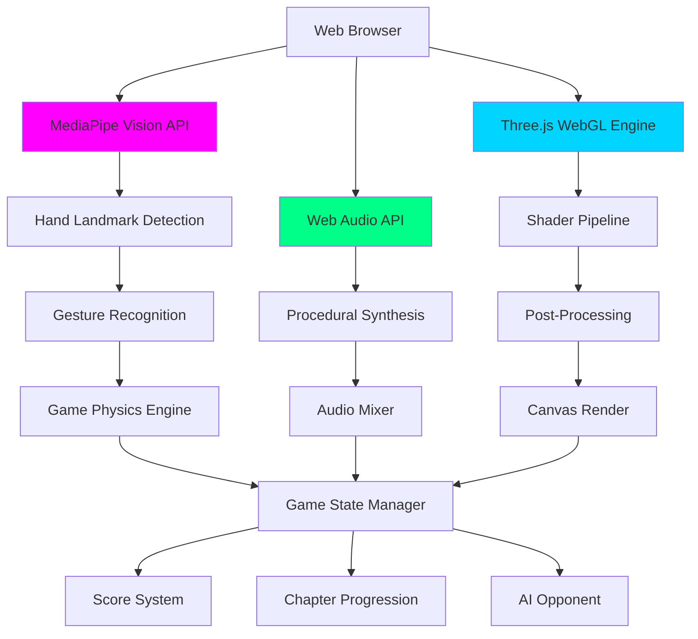

# 🏒 Aura Hockey AR - Enhanced Edition

**Ankara AI Hackathon 2026 | Yapay Zeka Tabanlı AR Oyun Platformu**

[](https://btkakademi.gov.tr)
[](https://mediapipe.dev)
[](https://threejs.org)
[](https://ucanblehub.com)

> **"Yapay Zeka ile Oyun Deneyimini Yeniden Tanımlıyoruz"**  
> *Eller serbest, kontrol zihinsel, deneyim sınırsız.*

## 🎥 Demo Video

[](https://drive.google.com/file/d/1QetjbLApR4l6Q946EUHcsBSL5Z-XdQt2/view)

**Başlangıç Arayüzü Videosu** - Oyunun nasıl başlatıldığını ve el takibinin nasıl çalıştığını görün!

---

## 💡 Proje Genel Bakış

Aura Hockey AR, yapay zeka destekli el takibi teknolojisi ile klasik air hockey oyununu yeniden tanımlayan, tamamen tarayıcı tabanlı bir artırılmış gerçeklik (AR) oyun platformudur. Google MediaPipe Hands teknolojisi sayesinde, kullanıcılar herhangi bir fiziksel kontrolcü olmadan, sadece ellerini kullanarak oyunu kontrol edebilirler. Bu proje, Ankara AI Hackathon 2026 kapsamında geliştirilmiş olup, oyun erişilebilirliğini artırmayı ve donanım bağımlılığını ortadan kaldırmayı hedeflemektedir.

Platform, sıfır kurulum gerektirir, anında erişim sağlar ve tüm modern tarayıcılarda sorunsuz bir şekilde çalışır. Amacımız, premium oyun deneyimini geniş kitlelere ulaştırarak oyun dünyasını demokratikleştirmektir.

---

## 🌟 Temel Özellikler

### 🧠 AI El Takibi Sistemi
Google MediaPipe Hands teknolojisi ile 60 FPS hızında, 20 milisaniyenin altında gecikme ile gerçek zamanlı el takibi sunar. 21 el landmark noktası ile hassas kontrol ve doğal bir oyun deneyimi sağlar. Otomatik kalibrasyon özelliği sayesinde kullanıcılar 2 saniye içinde oyuna hazır hale gelirler.

### 🎨 Premium Görsel Deneyim
Three.js ve WebGL 2.0 teknolojileri kullanılarak AAA kalitesinde 3D grafikler sunulur. Neon ışıklı arena tasarımı, hıza göre renk değiştiren pak izi efektleri, dinamik çarpışma parçacık sistemleri ve modern glassmorphism UI tasarımı ile sinematik bir görsel deneyim vaat eder.

### ⚙️ Gerçek Zamanlı Fizik Motoru
Özel olarak geliştirilmiş impulse-based fizik motoru ile gerçekçi pak dinamikleri sağlanır. AABB çarpışma algılama algoritması ile sub-pixel hassasiyetinde çarpışma tespiti yapılır. Adaptif AI rakip, 3 farklı zorluk seviyesinde oyunculara meydan okuyarak oyun deneyimini zenginleştirir.

### 🌐 Sıfır Kurulum Platformu
Oyun tamamen tarayıcı tabanlıdır ve herhangi bir kurulum gerektirmez. Anında erişim ve cross-platform uyumluluk sunar. Windows, macOS ve Linux işletim sistemlerinde, Chrome ve Edge tarayıcılarında tam destek ile 3 saniye içinde oyuna başlama imkanı sunar.

---

## 🏗️ Teknik Mimari

Projenin teknik mimarisi, yüksek performanslı yapay zeka entegrasyonu ve modern web teknolojileri üzerine kurulmuştur. Aşağıdaki diyagram, sistemin ana bileşenlerini ve etkileşimlerini göstermektedir:



### Teknoloji Stack

| Katman | Teknoloji | Amaç |
|--------|-----------|------|
| **AI/ML** | MediaPipe Hands (Google), TensorFlow.js | El takibi ve jest tanıma |
| **3D Engine** | Three.js r150, WebGL 2.0 | 3D renderlama, fizik entegrasyonu |
| **Shaders** | GLSL (Custom) | Dinamik yansımalar, görsel efektler |
| **Audio** | Web Audio API | Prosedürel müzik ve ses sentezi |
| **Post-FX** | EffectComposer (Bloom, Film, RGB Shift) | Gelişmiş görsel efektler |
| **UI** | Tailwind CSS | Duyarlı ve modern glassmorphism tasarım |
| **Deployment** | Static Hosting (Ucanble Hub, Vercel, GitHub Pages) | Kolay ve hızlı dağıtım |

### Performans Metrikleri

| Metrik | Değer | Açıklama |
|---|---|---|
| **Frame Rate** | 60 FPS | Sürekli ve akıcı oyun deneyimi |
| **AI Inference Latency** | 12-18ms (ortalama 15ms) | Yapay zeka tepki süresi |
| **Input-to-Screen Latency** | 20-25ms | Kullanıcı girdisinden ekrana yansıma süresi |
| **İlk Yüklenme Süresi** | ~3 saniye | Oyunun ilk açılış süresi |
| **Bellek Kullanımı** | 80-150MB | Tarayıcıda kullanılan bellek miktarı |

---

## 🚀 Kurulum ve Çalıştırma

Projeyi yerel ortamınızda çalıştırmak için aşağıdaki adımları takip edebilirsiniz:

1.  **Repoyu klonlayın:**
    ```bash
    git clone https://github.com/bahattinyunus/BTK-Hackathon26-Aura-Hockey-AR.git
    cd BTK-Hackathon26-Aura-Hockey-AR
    ```

2.  **Yerel sunucu başlatın (Python):**
    ```bash
    python -m http.server 8000
    ```
    *Not: Python yüklü değilse, herhangi bir statik dosya sunucusu (örn. `npm install -g http-server` ve `http-server`) kullanabilirsiniz.*

3.  **Tarayıcınızda açın:** `http://localhost:8000` adresine gidin.

### Sistem Gereksinimleri

-   **Modern Web Tarayıcısı:** Chrome 120+, Edge 120+ (Firefox ve Safari kısmi destek sunabilir)
-   **Web Kamerası:** Minimum 720p, önerilen 1080p
-   **RAM:** Minimum 4GB, önerilen 8GB
-   **GPU:** WebGL 2.0 desteği olan bir grafik işlemci önerilir

---

## 🎮 Kontroller

Aura Hockey AR, tamamen jest tabanlı kontrol mekaniği sunar:

-   **İşaret Parmağı:** Raketi oyun alanında hareket ettirmek için işaret parmağınızı kullanın.
-   **Yumruk (Fist):** Özel yetenek olan "Aura Burst"u şarj etmek ve aktive etmek için elinizi yumruk yapın. Bu yetenek, pakın hızını anlık olarak artırır.
-   **Seviye Atlama:** Her bölümde belirlenen skor hedefine ulaşarak bir sonraki hikaye aşamasına geçin ve yeni zorluklarla karşılaşın.

---

## 🎯 Kullanım Senaryoları

Aura Hockey AR, geniş bir kullanıcı kitlesine hitap eden çeşitli kullanım senaryoları sunar:

-   **Bireysel Eğlence:** Teknoloji meraklıları ve casual oyuncular için yenilikçi ve donanım maliyeti olmayan premium bir oyun deneyimi.
-   **Eğitim Kurumları:** STEM eğitimi için interaktif bir öğrenme aracı olarak AI/ML ve bilgisayar görüşü konseptlerinin pratik gösterimi.
-   **Sağlık ve Rehabilitasyon:** Fizik tedavi merkezlerinde el-göz koordinasyonu ve motor beceri rehabilitasyonu egzersizleri için gamified bir çözüm.
-   **Eğlence Mekanları:** Oyun kafeleri ve AVM'ler gibi eğlence merkezleri için kurulum gerektirmeyen, anında oynanabilir yeni nesil bir deneyim.

---

## 💼 İş Modeli ve Pazar Analizi

Aura Hockey AR, sürdürülebilir bir iş modeli ve geniş bir pazar potansiyeli sunmaktadır:

### İş Modeli

-   **Freemium B2C:** Temel oyun modu ücretsiz sunulurken, premium abonelik ile özel temalar, ileri AI modları, online multiplayer ve reklamsız deneyim gibi ek özellikler sunulur.
-   **B2B Eğitim Lisansı:** Eğitim kurumlarına yönelik yıllık lisans paketleri ile STEM eğitimi ve AI/ML öğretimi için platform erişimi sağlanır.
-   **Platform/SDK Lisansı:** Geliştiricilere yönelik SDK ve API erişimi ile üçüncü taraf entegrasyonlarına ve white-label çözümlerine olanak tanınır.

### Pazar Fırsatı ve Rekabet

-   **Global Browser Gaming Pazarı:** 2026 yılında 8.2 milyar dolara ulaşması beklenen bu pazarda önemli bir yer edinme potansiyeli.
-   **AI-Powered Gaming:** Hızla büyüyen yapay zeka destekli oyun segmentinde öncü olma fırsatı.
-   **Rekabetçi Avantajlar:** Geleneksel ve VR/AR oyunlarına kıyasla sıfır donanım maliyeti, yüksek erişilebilirlik ve benzersiz AI jest kontrolü ile öne çıkmaktadır.

---

## 🗺️ Yol Haritası

Projenin gelecek planları ve geliştirme aşamaları aşağıdaki gibidir:

-   **Q1 2026 (Tamamlandı):** MVP lansmanı, açık kaynak yayını, Ankara AI Hackathon 2026 katılımı.
-   **Q2-Q3 2026 (Planlanan):** Multiplayer modu geliştirme (WebRTC), premium tier lansmanı, mobil optimizasyon ve PWA dönüşümü.
-   **Q4 2026 (Planlanan):** B2B pilot programları, cloud save ve global liderlik tablosu, topluluk oluşturma.
-   **2027-2028 (Vizyon):** Platform genişlemesi, SDK lansmanı, yeni oyun modları ve uluslararası pazar genişlemesi.

---

## 🤝 Katkıda Bulunma

Aura Hockey AR açık kaynak bir projedir ve topluluk katkılarına açıktır. Geliştirmeye katkıda bulunmak, hata bildirmek veya yeni özellikler önermek için lütfen GitHub Issues bölümünü ziyaret edin.

---

## 📄 Lisans

Bu proje MIT Lisansı altında yayınlanmıştır. Daha fazla bilgi için `LICENSE` dosyasına bakınız.

----- 

## ✉️ İletişim

Proje hakkında daha fazla bilgi almak, iş birliği yapmak veya geri bildirimde bulunmak için aşağıdaki kanallardan iletişime geçebilirsiniz:

-   **GitHub:** [bahattinyunus](https://github.com/bahattinyunus)
-   **LinkedIn:** [yunuscetin](https://linkedin.com/in/yunuscetin)

---

**© 2026 NEO-ANKARA INDUSTRIES**
